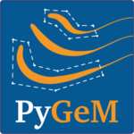

# PyGeM [](https://travis-ci.org/mathLab/PyGeM) [](https://coveralls.io/github/mathLab/PyGeM?branch=master)
Python Geometrical Morphing.



## Description

If you find this collection useful, feel free to download, use it and suggest pull requests!

The official distribution is on GitHub, and you can clone the repository using

	git clone https://github.com/mathLab/PyGeM


## Documentation

`PyGeM` uses [Sphinx](http://www.sphinx-doc.org/en/stable/) for code documentation. To build the html versions of the docs simply:

```bash
> cd docs
> make html
```

The generated html can be found in `docs/build/html`. Open up the `index.html` you find there to browse

## Testing

We are using Travis CI for continuous intergration testing. You can check out the current status [here](https://travis-ci.org/mathLab/PyGeM).

To run tests locally:

```bash
> python test.py
```


## License

See the [LICENSE](LICENSE.rst) file for license rights and limitations (MIT).