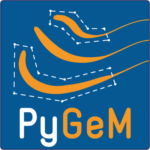

# PyGeM [](https://travis-ci.org/mathLab/PyGeM) [](https://coveralls.io/github/mathLab/PyGeM?branch=master)
Python Geometrical Morphing.



## Description
**PyGeM** is a python library using **Free Form Deformation** to parametrize and morph complex geometries.  It is ideally suited for actual industrial problems, since it allows to handle:

- Computer Aided Design files (in .iges and .stl formats)
- Mesh files (in .unv and OpenFOAM formats)

By now, it has been used with meshes with up to 14 milions of cells. Try with more and more complicated input files!

Here two applications are shown, taken from the **naval** and **automotive** engineering fields. On the other hand, the provided tutorials are related to easier geometries.

<p align="center">

</p>
<p align="center">
<em>DTMB-5415 hull: morphing of the bulbous bow starting from an industrial .iges CAD file.</em>
</p>

<p align="center">

</p>
<p align="center">
<em>DrivAer model: morphing of the bumper starting from an OpenFOAM mesh file.</em>
</p>

If you find this collection useful, feel free to download, use it and suggest pull requests!


## Prerequisites and installation
**PyGeM** requires:
- **numpy**;
- **numpy-stl**;
- **matplotlib**;


The official distribution is on GitHub, and you can clone the repository using

	git clone https://github.com/mathLab/PyGeM


## Documentation
**PyGeM** uses [Sphinx](http://www.sphinx-doc.org/en/stable/) for code documentation. To build the html versions of the docs simply:

```bash
> cd docs
> make html
```

The generated html can be found in `docs/build/html`. Open up the `index.html` you find there to browse.


## Testing
We are using Travis CI for continuous intergration testing. You can check out the current status [here](https://travis-ci.org/mathLab/PyGeM).

To run tests locally:

```bash
> python test.py
```


## Authors and contributors
**PyGeM** is currently developed and mantained at [SISSA mathLab](http://mathlab.sissa.it/) by
* [Filippo Salmoiraghi](mailto:filippo.salmoiraghi@gmail.com)
* [Marco Tezzele](mailto:marcotez@gmail.com)

under the supervision of [Prof. Gianluigi Rozza](mailto:gianluigi.rozza@sissa.it).

Contact us by email for further information or questions about **PyGeM**, or suggest pull requests. **PyGeM** is at an early development stage, so contributions improving either the code or the documentation are welcome!


## How to contribute
We'd love to accept your patches and contributions to this project. There are
just a few small guidelines you need to follow.

### Submitting a patch

  1. It's generally best to start by opening a new issue describing the bug or
     feature you're intending to fix.  Even if you think it's relatively minor,
     it's helpful to know what people are working on.  Mention in the initial
     issue that you are planning to work on that bug or feature so that it can
     be assigned to you.

  2. Follow the normal process of [forking][] the project, and setup a new
     branch to work in.  It's important that each group of changes be done in
     separate branches in order to ensure that a pull request only includes the
     commits related to that bug or feature.

  3. To ensure properly formatted code, please make sure to use a tab of 4
     spaces to indent the code. You should also run [pylint][] over your code.
     It's not strictly necessary that your code be completely "lint-free",
     but this will help you find common style issues.

  4. Any significant changes should almost always be accompanied by tests.  The
     project already has good test coverage, so look at some of the existing
     tests if you're unsure how to go about it. We're using [coveralls][] that
     is an invaluable tools for seeing which parts of your code aren't being
     exercised by your tests.

  5. Do your best to have [well-formed commit messages][] for each change.
     This provides consistency throughout the project, and ensures that commit
     messages are able to be formatted properly by various git tools.

  6. Finally, push the commits to your fork and submit a [pull request][]. Please,
     remember to rebase properly in order to maintain a clean, linear git history.

[forking]: https://help.github.com/articles/fork-a-repo
[pylint]: https://www.pylint.org/
[coveralls]: https://coveralls.io
[well-formed commit messages]: http://tbaggery.com/2008/04/19/a-note-about-git-commit-messages.html
[pull request]: https://help.github.com/articles/creating-a-pull-request


## License

See the [LICENSE](LICENSE.rst) file for license rights and limitations (MIT).
